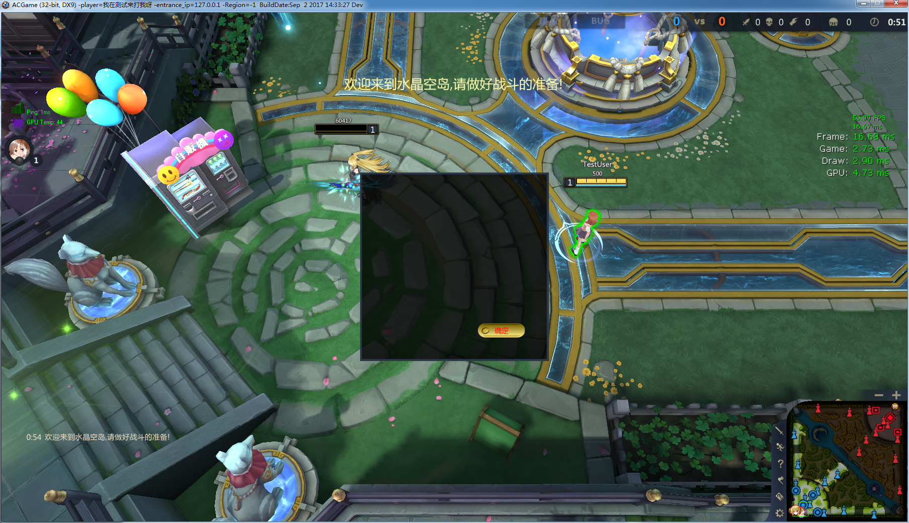

## Hello world

自定义界面的相关信息用 json 来描述，json 中可以包含控件的类型、布局、父子关系等信息，也可以根据不同的控件类型指定一些控件特有的属性，如文本、背景图片、字体、颜色等。

例如，下面的 json 描述了一个居中显示的带有一个确定按钮的对话框：

```
{
    // type 指定控件类型是一个面板
    // 每个控价对象必须包含这个属性，以确定控件类型
    "type": "panel",

    // 控件 id ，是控件的一个全局标识符，必须全局唯一
    "id": "test_panel",

    // 坐标及宽高
    "x": 0,
    "y": 0,
    "w": 400,
    "h": 400,

    // 锚点布局，指定控件自己的锚点和父控件的锚点。对最底层控件而言，父控件是游戏窗口。
    // 这里指定两个锚点为中心点 "center"，而 x 和 y 都为 0，代表面板和游戏窗口的中心重合。
    "parent_anchor": "center",
    "self_anchor": "center",

    // 背景图片, 这个属于控件特有的属性，后面会列出各种控件都包含哪些属性
    "background_image": "image/tips.png",

    // 面板包含的子控件, 是一个数组，面板可以无限嵌套
    "children": [
        {
            "type" : "button",
            "id": "test_button",

            // 这里没指定锚点，则 x, y 为相对父控件左上角的坐标
            "x": 250,
            "y": 320,
            "w": 100,
            "h": 30,
            "text": "确定",
            "normal_image": "image/button.png"
        }
    ]
}
```

对应的界面效果：

[查看大图](images/helloworld.png)

---

## 通过 ui.json 文件创建界面

每张地图加载后都会读取 `CustomUI/Gaming/Scipt/ui.json` 创建一个默认界面。ui.json 的文件结构如下：


```
{
    // 这是一个默认要显示的控件数组
    "content": [

        // 这里可以包含上面所描述的控件的 json 信息
        {
            "id" : "panel_1",
            "type" : "panel",
            
            // 下略
        },

        // 可以包含多个控件
        {
            "id" : "panel_2",
            "type" : "panel",

            // 下略
        }
    ]
}
```

以上面提到的对话框为例，如果想要在游戏一开始的时候显示对话款，可以将 ui.json 文件修改成这样:
```
{
    "content": [
        {
            // type 指定控件类型是一个面板
            // 每个控价对象必须包含这个属性，以确定控件类型
            "type": "panel",

            // 控件 id ，是控件的一个全局标识符，必须全局唯一
            "id": "test_panel",

            // 坐标及宽高
            "x": 0,
            "y": 0,
            "w": 400,
            "h": 400,

            // 锚点布局，指定控件自己的锚点和父控件的锚点。对最底层控件而言，父控件是游戏窗口。
            // 这里指定两个锚点为中心点 "center"，而 x 和 y 都为 0，代表面板和游戏窗口的中心重合。
            "parent_anchor": "center",
            "self_anchor": "center",

            // 背景图片, 这个属于控件特有的属性，后面会列出各种控件都包含哪些属性
            "background_image": "image/tips.png",

            // 面板包含的子控件, 是一个数组，面板可以无限嵌套
            "children": [
                {
                    "type" : "button",
                    "id": "test_button",

                    // 这里没指定锚点，则 x, y 为相对父控件左上角的坐标
                    "x": 250,
                    "y": 320,
                    "w": 100,
                    "h": 30,
                    "text": "确定",
                    "normal_image": "image/button.png"
                }
            ]
        }
    ]
}
```

默认布局文件的文件名 ui.json 是可以更改的，参见 `CustomUI/Gaming/Script/config.lua` 中加载 json 文件的代码，你可以将它修改为其他 json 文件：


---

## 动态创建界面

一些界面接口提供动态添加界面的功能，如 `add_child`、`set_tooltip` 等。

这些接口一般要求提供一个 json 字符串作为参数，这个 json 中定义的属性和上面提到的 json 定义是一致的。

例如，下面的 lua 代码是在选择英雄后，动态给面板添加 4 个技能框：

```
for i = 1 , 4 do

    -- 技能按钮的 id 动态生成
    name = "spell_slot_" .. i

    -- 动态增加按钮的 x 坐标
    main_x = icon_padding + (icon_width + icon_spacing) * (i - 1)

    -- 注意，这里用 lua 的表记录界面信息，看上去清晰一些
    -- 后面在调用界面接口时，用 json.encode 把 lua 的表结构转换成 json 字符串
    control_info = {
            type = "button",
            id = name,
            x = main_x + 2,
            y = 4,
            w = icon_width,
            h = icon_heigth,
            z_index = 1002,
            normal_image = "image/HeroMainPanel/遮罩.png",
            mask = "image/HeroMainPanel/遮罩2.png",
    }

    -- 调用 add_child 接口，在技能面板中插入按钮
    -- json.encode 方法将 table 转化成 json 字符串传给前端
    common.InvokeFrontEndMethod("add_child" , parent_panel , json.encode(control_info))
end

```
---

## 通用属性


下面列出的属性是所有类型的控件都拥有的：

- `type [string]` 必填项，表明控件的类型，可以是以下值
    - `panel` 面板，一般作为其他空间的容器
    - `button` 按钮，包含显示技能冷却效果的功能
    - `label` 标签，用来显示文本、图片、播放动画
    - `progress_bar` 进度条，如血条
    - `rounded_progress_bar` 圆形进度条，如 5v5 的经验条
    - `canvas` 画布，可以在上面画线、矩形、圆形、动画等
    - `button_group` 按钮组，如背包
    - `video` 视频
    - `input` 输入框

- `id [string]` 控件的 id，必填项，必须全局唯一，很多界面接口需要传入这个 id 作为控件唯一标识符
- `x [int]` `y [int]` 必填项，控件自身锚点相对于父控件锚点（如果是最顶层控件，那么则是相对于屏幕锚点）的坐标。如果没指定锚点，则是控件左上角相对于父控件左上角的坐标。可以为负数。
- `w [int]` `h [int]` 控件的宽高
- `z_index [int]` 控件的层级，这个值比较大的控件会显示在其他控件上面，取值 0 ~ 9999
- `show [bool]` 控件刚创建时是否显示
- `disable_mouse_through [bool]` 是否禁用鼠标穿透，如果设置为 true，鼠标在界面上移动及点击右键不会传递给游戏
- `parent_anchor [string]` `self_anchor [string]` 父控件和子控件的锚点。可以为以下 9 个值之一：
    - `top_left` `top_center` `top_right`
    - `left_center` `center` `right_center`
    - `bottom_left` `bottom_center` `bottom_right`

```
-- 举例：在距离屏幕右下角 (30,30) 处显示一个按钮，对应的 json 为
{
    "x" : -30,
    "y" : -30,
    "w" : 100,
    "h" : 30,
    "parent_anchor" : "bottom_right",
    "self_anchor" : "bottom_right"
}

```

---

## 控件类型：面板

面板包含的属性如下：

- `background_image [string]` 背景图片路径，用 / 分割，如 `"background_image": "image/HeroMainPanel/panel_2.png"`，其中 image 目录对应 CustomUI/Gaming/View/image ，资源图片都放在这个目录里面
- `border_image_slice` `border_image_source` `border_image_width` 用于指定面板的九宫格切分，这样当面板大小变化时，面板的背景图片4个角不会被拉伸，4条边只会横向或纵向拉伸，避免图片失真。具体例子参见 5v5 的道具面板的 json 定义。
- `grid_layout [bool]` 是否采用浮动布局。如果采用浮动布局，则面板的子控件中定义的 `x` `y` 属性失效，由面板按顺序自动排列所属的子控件。为浮动布局的面板添加子控件时，应该使用 `append_child` 方法。当子控件所占空间大于面板空间时，面板会显示滚动条。
- `children [array]` 指定面板的子控件，面板的子控件可以是任意类型的控件。 
- `base_line [string]` 仅当 panel 作为 tooltip 时有效，可选值：`top` `bottom` 。指定 tooltip 的对齐方式，是底部对齐还是顶部对齐。
- `enable_scroll [bool]` 设置为 true 时，当 panel 中子控件区域超出 panel 大小时，会出现滚动条
- `scroll_bar_color [string]` `scroll_bar_hover_color [string]` 滚动条颜色，分为通常状态和鼠标滑过时的状态

---

## 控件类型：按钮

按钮控件的属性如下：

- `normal_image [string]` 按钮图片路径
- `hover_image [string]` 鼠标移到按钮上显示的图片
- `active_image [string]` 鼠标点击按钮显示的图片
- `disable_image [string]` 按钮禁用状态时的图片
- `mask [string]` 遮罩图片，指定一张方形的背景图片和一张圆形的遮罩，可以将方形的背景图裁剪为圆形
- `text [string]` 按钮的文本
- `color [string]` 文本颜色，如 `#ff0000` 或 `rgba(255, 0, 0, 0.5)`
- `font_weight [string]` 文本粗细，可选项 `normal` 或 `bold`
- `font_family [string]` 字体，如 `Microsoft Yahei`
- `font_size [int]` 字体大小
- `toggle [bool]` 指定为 true 时，此按钮为开关按钮
- `toggle_image [string]` 仅当 `toggle` 为 true 时有效，为按钮关闭状态时的路径
- `outline_Image [string]` [目前只在移动平台使用]额外的图片属性,通常用于給技能按钮设置一个圆形的环
- `Brush_Percent [float]` [目前只在移动平台使用]设置图片在控件上的比例[0.1, 1.0],默认0.9,通常跟技能的圆形环配合,即按钮最边缘是0.1宽度(相对于按钮自身的半径比例)的环,环内部是0.9直径的技能Icon
- `Ignore_TouchMove [bool]` [目前只在移动平台使用]是否忽略TouchMove事件,默认为true


按钮控件也可以用来显示技能的冷却效果，相关属性如下：

- `cool_down_show_text [bool]` 是否显示倒计时文本
- `cool_down_font_size [string]` 倒计时文本字体大小
- `cool_down_revert [bool]` 冷却效果默认顺时针转动，将这个属性设置成 true 时，冷却效果将反转。

---

## 控件类型：标签

标签可以显示文本、图片或序列帧动画

- `text [string]` 文本内容
- `text_align [string]` 对齐方式 ： left，center，right
- `vertical_align [string]` 垂直对齐方式，目前只支持垂直对齐 center
- `line_height [int]` 行高
- `color [string]` 文本颜色，如 `#ff0000` 或 `rgba(255, 0, 0, 0.5)`
- `font_weight [string]` 文本粗细，可选项 `normal` 或 `bold`
- `font_family [string]` 字体，如 `Microsoft Yahei`
- `font_size [int]` 字体大小
- `border_image_slice` `border_image_source` `border_image_width` 和 panel 的对应属性功能一致
- `mask [string]` 遮罩图片，指定一张方形的背景图片和一张圆形的遮罩，可以将方形的背景图裁剪为圆形
- `enable_animation [bool]` 设置为 true 时，可以播放序列帧动画
- `show_animation_last_frame [bool]` 播放序列帧时，是否停留在最后一帧
- `has_tooltip [bool]` 设置为 true 时，鼠标移入时可以显示提示框
- `model_view [bool]` 设置为 true 时，可以显示模型预览框
- `animation_duration [number]` 设置使用 `show_with_animation` 和 `hide_with_animation` 播放动画时，动画的持续时间
- `Capture_Touch [bool]` 是否捕获焦点, 设置为 true 时，则捕获焦点,即手指离开控件区域, 控件仍然可以接受手指滑动事件, 默认false
---

## 控件类型：富文本框(RichTextBlock)
[注意]目前只在移动平台使用

在移动平台上普通的标签不支持富文本显示,如要显示富文本(比如spell/buff的提示信息),则需要使用富文本控件

- `text [string]` 文本内容
- `text_align [string]` 对齐方式 ： left，center，right
---

## 控件类型：进度条

默认情况下，进度条上会显示类似 `50/100` 的展示进度的文本。

- `color [string]` 进度条上文本的颜色
- `font_faimly [string]` 文本字体
- `font_size [int]` 文本字体大小
- `background_image [string]` 进度条背景图片
- `show_text [bool]` 是否显示进度条文本
- `head_animation [string]` 进度条头部的序列帧动画路径
- `invert [bool]` 是否反向显示进度

---

## 控件类型：圆形进度条

圆形进度条与进度条类似，只是表现形式不同，参见 5v5 技能面板的经验条。

- `color [string]` 进度条的颜色
- `mask_image [string]` 进度条的背景图片，根据当前进度会对这张图片进行裁剪

---

## 控件类型：画布

画布控件可用来绘制简单的图形。

- `backgroun_color [string]` 背景色

---

## 控件类型：按钮组

按钮组包含一系列按表格布局的按钮，如背包

- `item_count [int]` 按钮组中的按钮数量
- `item_width [int]` 按钮组中按钮的宽度
- `item_height [int]` 按钮组中按钮的高度
- `item_background_image [string]` 按钮组空格子的背景图

---

## 控件类型：视频

视频控件用来播放 `webm` 格式的视频

- `video_path [string]` 视频文件的路径

---

## 控件类型：输入框

用于输入文字

- `border_width [number]` 边框宽度
- `border_color [string]` 边框颜色
- `text_align [string]` 对齐方式 ： left，center，right
- `color [string]` 文本颜色，如 `#ff0000` 或 `rgba(255, 0, 0, 0.5)`
- `font_weight [string]` 文本粗细，可选项 `normal` 或 `bold`
- `font_family [string]` 字体，如 `Microsoft Yahei`
- `font_size [int]` 字体大小

## 控件类型：摇杆(VirtualJoystick)

[目前只能在移动平台使用]用于移动平台的交互

- `Background_Image [string]` 摇杆的背景图片,需要一个正方形图片(通常会设置为一个有圆形图形内容的图片,因为摇杆一般都是圆形的)
- `Thumb_Image [string]` 跟随手指移动的小图片,需要一个正方形图片(通常会设置为一个有圆形图形内容的图片)
- `Thumb_Size [float]` 跟随手指移动的小图片的大小： 数据范围在[0.1, 0.9], 即小图片的半径相对于整个控件的比例,默认为0.4
- `Background_Size [float]` 背景图片的大小: 数据范围在[0.1, 0.9], 即背景图片的半径相对于整个控件的比例,默认为1.0. 通常不需要设置这个属性,除非你希望摇杆本身能跟随手指第一次触摸时调自动调整位置
- `Auto_Position [bool]` 摇杆是否根据手指第一次点击位置自动调整位置，需要配合Background_Size使用, 默认false

## 控件类型：垂直排列面板VerticalBox

[目前只能在移动平台使用]用于垂直排列若干子控件


## 控件类型：水平排列面板HorizontalBox

[目前只能在移动平台使用]用于水平排列若干子控件

## 控件类型：自动换行排版面板WrapBox

[目前只能在移动平台使用]用于自动排列若干子控件
默认是水平排列若干子控件,当一行无法容纳更多子控件时,自动将后续子控件排版在下一行

- `SlotPaddingX [number]` 列间距
- `SlotPaddingY [number]` 行间距
- `WrapWidth [number]` 在指定宽度位置换行
- `ExplicitWrapWidth [bool]` 是否禁用实时自动排版,默认是开启的.如果需要实现自由改变面板大小,并及时正确排版,需要指明此属性为false,如果面板大小很少改变大小,则应该使用默认值


## 控件类型：滚动框排版面板ScrollBox

[目前只能在移动平台使用]用于带滚动效果的面板,当面板可视区域内无法容纳更多子控件时可以滚动以显示更多的控件

- `Orientation [int]` 滚动方向,默认是垂直方向(1), 可根据需要改为水平方向
- `ScrollBar_Visible [bool]` 是否显示滚动条,滚动条的可见性不影响面板内容可否滚动
