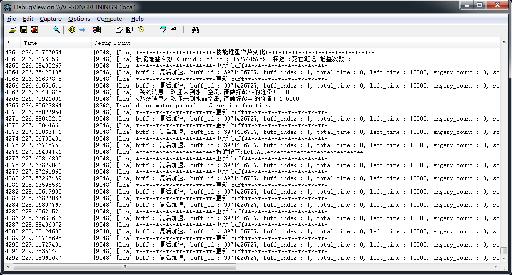
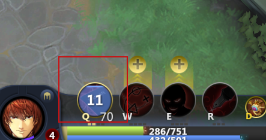
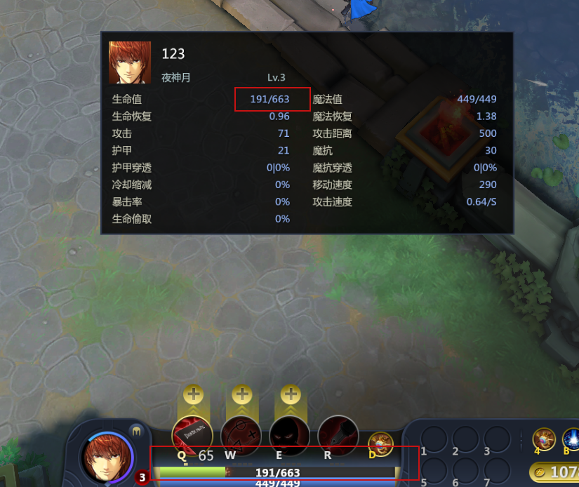

### 查看日志

使用 `utils.debugf(debug_string)` 可以打印日志信息。

日志信息可以使用工具 [DebugView.exe](ftp://192.168.130.33/Soft/Dbgview.exe) 来查看



弹框测试可以使用 `common.MessageBox(debug_string)` ：


---

一些常用的功能被封装到了 `CustomUI/Gaming/Script/common` 中，主要包括：

### 技能（物品）绑定到控件

如果需要显示一个技能按钮，只需要修改 `config.lua` 中的 table `config.spell_slot_bindings` 即可。

config.spell_slot_bindings[技能槽位] = {按钮控件 id}

```
config.spell_slot_bindings[0] = {"spell_button_0"}
```

上面这句话代表将英雄的第 1 个技能（槽位为0）绑定到控件 id 为 "spell_button_0" 的按钮上。不需要额外的代码，这个按钮就拥有了技能的大部分功能，包括技能冷却效果、技能的 tips、点击技能按钮释放技能等。技能状态的变化会自动更新到这个按钮上。

显示效果如图：



同理，物品和召唤师技能的绑定也是同样的一行代码，只是槽位不同

- 技能的槽位 0 ~ 99
- 物品的槽位 100 ~ 199
- 饰品的槽位 200 ~ 299
- 隐藏技能的槽位 300 ~ 

---

### 单位属性绑定到控件

如果需要某控件显示单位属性，当单位属性变化时，控件显示的内容自动更新，只需要修改 table `config.unit_attribute_bindings` 即可。

```
config.unit_attribute_bindings = {
	["生命"] = {
		{"hp_bar:now"},
		{"main_hero_hp" , function(value)
			return string.format("%.f" , value) .. "/" .. string.format("%.f" , attribute.get_my_unit_attr("生命上限"))
		end}, 
	},
	["生命上限"] = {
		{"hp_bar:max"},
		{"main_hero_hp" , function(value)
			return string.format("%.f" , attribute.get_my_unit_attr("生命")) .. "/" .. string.format("%.f" , value)
		end},
	},
}
```

上面这段代码表示将玩家的生命值和生命上限分别绑定到 2 个控件上 ： `hp_bar` 和 `main_hero_hp`。

其中 `hp_bar` 是进度条控件，`main_hero_hp` 是标签控件。

当玩家生命值或生命上限变化时，进度条和标签控件会自动更新。

注意， `main_hero_hp` 控件提供了一个回调函数，用于将传入的生命值或生命上限值转化成想要显示的格式 `生命值/生命上限`。

显示效果如图：



---


### 玩家属性绑定到控件

修改 `config.player_attribute_bindings` ,用法和单位属性绑定到控件类似。例子：

```
config.player_attribute_bindings = {
	["金钱"] = {
		{"item_slot_shop_show" , function(value)
			return "<b>" .. string.format("%.0f", value) .. "</b>"
		end},
	}
}
```

---

### buff 绑定到控件

将 buff 的相关功能绑定到指定 id 的控件，分别修改 `config.buff_bindings` 和 `config.debuff_bindings` 。例如：

```
config.buff_bindings = {

    -- 以下为控件 id
    "buff_1",
    "buff_2"
}

config.buff_bindings = {

    -- 以下为控件 id
    "debuff_1",
    "debuff_2",
    "debuff_3"
}
```

上面的代码代表最多显示 2 个 buff ， 3 个 debuff。

---

### 客户端控制台输入 lua 代码

ExecuteLua **Lua 代码**

一般用来测试用，例如：


---

### 常用功能

- 获取技能属性 - `spell.get_spell(spell_unique_id, desc)`  例子：
```
spell.get_spell_attr(spell_unique_id, "等级")
```
- 获取技能描述 - `spell.get_spell_desc(spell_unique_id)`
- 根据技能槽位获取技能唯一 id - `spell.slot_table[spell_slot]`
- 获取单位属性 - `attribute.get_unit_attr(unit_desc, desc)` 例子：
```
attribute.get_unit_attr(attribute.get_my_unit_id(), "魔法上限")
```
- 获取单位名字 - `attribute.get_unit_desc(unit_id)`
- 获取自身单位属性 - `attribute.get_my_unit_attr(desc)`，例子：
```
attribute.get_my_unit_attr("等级")
```
- table 转 json - `json.encode(lua_table)`
- json 转 table - `json.decode(json_str)`

---
